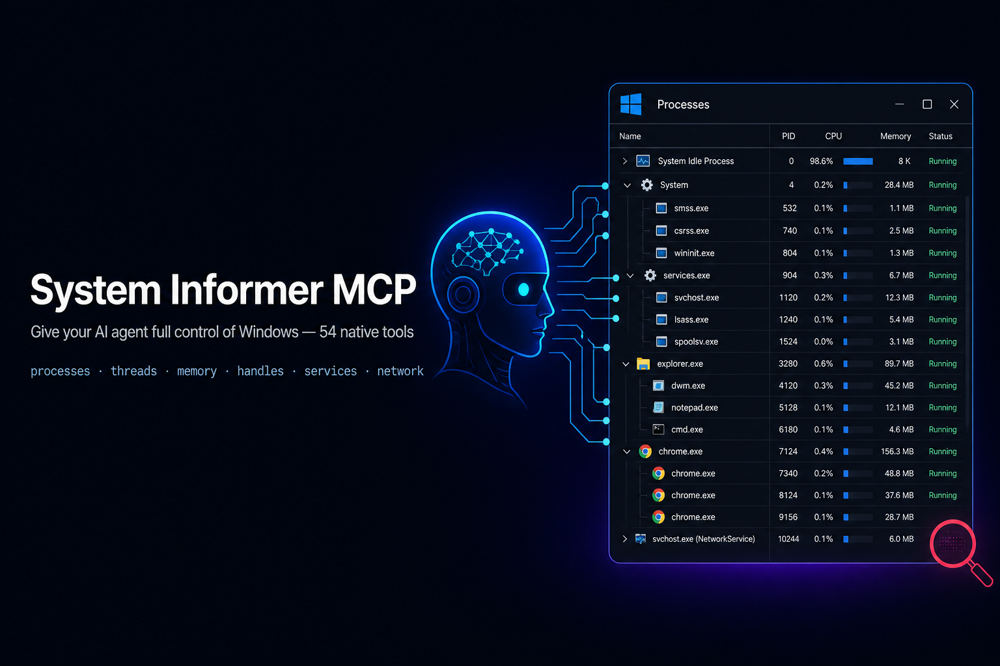
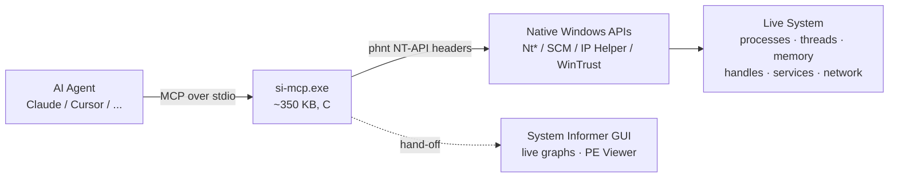

<div align="center">



# System Informer MCP

**Give your AI agent the full power of [System Informer](https://github.com/winsiderss/systeminformer) (Process Hacker) on Windows.**

A lightweight, native **Model Context Protocol** server — written in C, ~350 KB, zero runtime dependencies — that lets an LLM inspect and control Windows the same way a human does through the System Informer GUI: processes, threads, memory, handles, services, network, drivers, windows and more.

[](https://github.com/Xiaobocai08/system-informer-mcp/actions/workflows/build.yml)
[](https://github.com/Xiaobocai08/system-informer-mcp/releases/latest)
[](https://github.com/Xiaobocai08/system-informer-mcp/releases)
[](LICENSE)
[](https://github.com/Xiaobocai08/system-informer-mcp)
[](https://github.com/Xiaobocai08/system-informer-mcp)
[](https://modelcontextprotocol.io)
[](#all-54-tools)
[](CONTRIBUTING.md)

**[⬇ Download the prebuilt `si-mcp.exe` (v1.0.0, x64)](https://github.com/Xiaobocai08/system-informer-mcp/releases/latest)** — no compiler needed

English | [简体中文](README.zh-CN.md)

</div>

---

> **TL;DR** — Ask your AI: *"What's using port 3000?"*, *"Why is my CPU at 100%?"*, *"Which process is locking this DLL?"*, *"Is this .exe validly signed?"*, *"Start Notepad, then suspend it."* — and it just does it, through 54 well-documented native tools.

## Why this exists

Modern System Informer builds have **no headless / command-line mode** — the switches only configure the GUI. So instead of scraping a GUI (fragile and lossy), this server does exactly what System Informer itself does: it compiles against System Informer's own **`phnt`** NT-API headers and calls the same native Windows APIs (`NtQuerySystemInformation`, `NtQueryInformationProcess/Thread`, the Service Control Manager, IP Helper, `WinVerifyTrust`, ...). Results come back as structured JSON instead of GUI tables.

That is the tightest practical coupling to *how System Informer actually works* — and it means your AI never has to guess.

## Highlights

- **54 tools** covering every System Informer data view and action.
- **Native & tiny.** Pure C, a single ~350 KB `si-mcp.exe`, no Python/Node runtime, no DLLs to ship.
- **The AI never guesses.** A rich `instructions` block at startup, a fully documented JSON Schema for every argument (types, enums, defaults), and ready-made workflow **prompts**.
- **Safe by default.** Every destructive/irreversible action is guarded behind an explicit `confirm: true`; killing a *critical* process needs a second gate. Every handler runs under a structured-exception guard so a fault returns an error instead of crashing the server.
- **Honest about privileges.** `server_status` tells you exactly what you can and cannot see given your elevation.

## See it in action

```jsonc
// Ask: "What is listening on port 3000?"
→ port_owner { "port": 3000 }
← { "port": 3000, "matches": 1,
    "owners": [ { "protocol": "TCP", "local": "0.0.0.0:3000",
                  "state": "LISTEN", "pid": 18240,
                  "processImage": "C:\\Program Files\\nodejs\\node.exe" } ] }

// Ask: "Start Notepad, then suspend it."
→ launch_process   { "command_line": "notepad.exe" }        → { "pid": 51432 }
→ suspend_process  { "pid": 51432, "confirm": true }        → { "status": "ok" }
```

## How it works



## Quick start

### 1. Get the binary

**Option A — download (recommended).** Grab `si-mcp-v1.0.0-windows-x64.exe` from the [latest release](https://github.com/Xiaobocai08/system-informer-mcp/releases/latest) and put it anywhere. It is a single ~340 KB file with no dependencies. `SHA256SUMS.txt` is provided for verification.

**Option B — build from source.** Requires **Visual Studio 2022** (or the free Build Tools) with the *Desktop development with C++* workload and a Windows 10/11 SDK. Nothing else — no CMake, no package manager.

```bat
git clone https://github.com/Xiaobocai08/system-informer-mcp.git
cd system-informer-mcp
build.bat
:: -> build\si-mcp.exe
```

The `phnt` headers are vendored in `third_party/phnt`, so the repo builds on its own.

### 2. Register with your MCP client

<details open>
<summary><b>Claude Code</b></summary>

```bat
claude mcp add system-informer -- "C:\path\to\system-informer-mcp\build\si-mcp.exe"
```
</details>

<details>
<summary><b>Cursor / Claude Desktop / any stdio MCP client</b> (config JSON)</summary>

```json
{
  "mcpServers": {
    "system-informer": {
      "command": "C:\\path\\to\\system-informer-mcp\\build\\si-mcp.exe"
    }
  }
}
```
</details>

> Run your client **as Administrator** for full coverage. Call `server_status` any time to see what you have.

### 3. Ask your AI

> *"Show me the top 5 processes by memory, then tell me if the biggest one is signed."*

## All 54 tools

| Group | Tools |
|---|---|
| **System** | `server_status` · `system_overview` · `system_cpu_usage` · `system_memory` · `system_uptime` |
| **Processes** | `list_processes` · `process_tree` · `process_details` · `process_token` |
| **Process control** | `launch_process` · `launch_process_elevated` · `terminate_process` · `terminate_process_tree` · `suspend_process` · `resume_process` · `set_process_priority` · `set_process_affinity` · `empty_working_set` · `set_process_critical` · `create_process_dump` |
| **Threads** | `process_threads` · `thread_details` · `suspend_thread` · `resume_thread` · `terminate_thread` · `set_thread_priority` · `set_thread_affinity` |
| **Memory** | `process_memory_regions` · `process_memory_summary` · `read_process_memory` · `write_process_memory` · `protect_process_memory` · `search_process_memory` · `process_memory_strings` |
| **Handles** | `list_handles` · `handle_type_summary` · `find_handles_by_name` · `close_handle` |
| **Services** | `list_services` · `service_details` · `control_service` · `set_service_start_type` · `create_service` · `delete_service` |
| **Network** | `network_connections` · `port_owner` |
| **Modules / Drivers** | `process_modules` · `list_drivers` |
| **Windows** | `list_windows` · `window_action` |
| **Files** | `file_details` · `verify_file_signature` |
| **GUI hand-off** | `launch_systeminformer_gui` · `launch_peview` |

Call `tools/list` for the full schema of each, and `prompts/list` for guided workflows: **diagnose high CPU**, **triage a suspicious process**, **what-locks-this-file**, **what-owns-this-port**, **inspect a process**.

## Privileges

Windows — not this server — decides what is visible. Run elevated for full coverage:

| Running as | Coverage |
|---|---|
| Standard user | Your own processes in full; others limited; kernel addresses hidden |
| **Administrator** | Nearly everything: all processes, service control, kernel addresses |
| Admin + KSystemInformer driver | Protected processes (PPL, antimalware) too |

## Safety model

Mutating or irreversible tools refuse to run without `"confirm": true` — `terminate_*`, `suspend/resume`, priority/affinity, `empty_working_set`, `set_process_critical`, `write_process_memory`, `protect_process_memory`, `close_handle`, all service mutations, and `window_action`. Terminating a Windows-critical process can bugcheck the machine, so that path has an extra `allow_critical` gate.

## How it compares

| | **system-informer-mcp** | Typical "system info" MCPs |
|---|---|---|
| Language / size | Native C, ~350 KB exe | Python/Node + runtime |
| Depth | Processes, threads, **memory r/w**, **handles**, tokens, services, network, drivers, windows, signatures | Usually read-only process/CPU/mem stats |
| Control actions | Terminate, suspend, priority, affinity, dumps, service & handle control | Rarely |
| Guidance to the LLM | Rich instructions + per-arg JSON Schema + prompts | Minimal |
| Safety | `confirm` guard + SEH isolation | Varies |

## Project layout

```
build.bat                 MSVC build script (no external build system)
src/
  main.c                  stdio JSON-RPC loop + MCP dispatch
  mcp.c / mcp.h           tool registry, argument & result helpers
  prompts.c               startup instructions + workflow prompts
  ntutil.c / ntutil.h     NT/Win32 helpers (phnt): UTF-8, SIDs, errors
  procsnap.c / procsnap.h shared process-snapshot helpers
  tools_*.c               one file per tool group
third_party/
  cJSON/                  vendored JSON library (MIT)
  phnt/                   vendored System Informer NT-API headers (MIT)
test/                     Python MCP client + end-to-end tests
```

## Testing

```bat
python test\mcp_client.py            :: initialize + list every tool
python test\test_all.py              :: exercise all 54 tools end-to-end
python test\roundtrip.py             :: launch -> inspect -> control -> dump -> terminate
```

`test_all.py` launches a throwaway Notepad, drives all 54 tools against it and the live system, checks the `confirm` guards, and reports coverage. Latest run: **56/56 checks passed, 54/54 tools covered** on Windows 11 (build 26200).

## FAQ

**Is this malware?** No. It is an open-source, auditable MCP server. It exposes exactly what the System Informer GUI already exposes to any administrator, over a local stdio channel to your own AI client. Every dangerous action is gated behind `confirm: true`.

**Does it need System Informer installed?** No — every inspection/control tool works standalone. Only the two GUI hand-off tools (`launch_systeminformer_gui`, `launch_peview`) need the app; set `SYSTEMINFORMER_PATH` if it is installed in a non-default location.

**macOS / Linux?** No. This is deeply Windows-specific by design (NT native APIs).

## Acknowledgements

- [System Informer](https://github.com/winsiderss/systeminformer) by Winsider Seminars & Solutions, Inc. — the `phnt` headers and the tool this project mirrors.
- [cJSON](https://github.com/DaveGamble/cJSON) by Dave Gamble.
- [Model Context Protocol](https://modelcontextprotocol.io) by Anthropic.

## Star history

<a href="https://star-history.com/#Xiaobocai08/system-informer-mcp&Date">
  
</a>

## License

[MIT](LICENSE). Builds against System Informer's `phnt` headers (MIT) and vendors cJSON (MIT).

---

<div align="center">
If this project helps you, please consider giving it a ⭐ — it genuinely helps others discover it.
</div>
