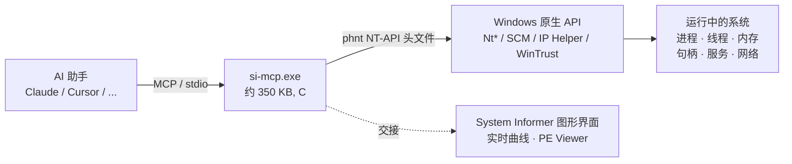

<div align="center">


# System Informer MCP

**让你的 AI 助手在 Windows 上拥有 [System Informer](https://github.com/winsiderss/systeminformer)（Process Hacker）的全部能力。**

一个轻量、原生的 **Model Context Protocol（模型上下文协议）** 服务器 —— 用 C 语言编写，约 350 KB，零运行时依赖 —— 让大模型像人类使用 System Informer 图形界面那样检查和控制 Windows：进程、线程、内存、句柄、服务、网络、驱动、窗口等等。

[](https://github.com/Xiaobocai08/system-informer-mcp/actions/workflows/build.yml)
[](https://github.com/Xiaobocai08/system-informer-mcp/releases/latest)
[](https://github.com/Xiaobocai08/system-informer-mcp/releases)
[](LICENSE)
[](https://github.com/Xiaobocai08/system-informer-mcp)
[](https://github.com/Xiaobocai08/system-informer-mcp)
[](https://modelcontextprotocol.io)
[](#全部-54-个工具)
[](CONTRIBUTING.md)

**[⬇ 下载预编译的 `si-mcp.exe`（v1.0.0，x64）](https://github.com/Xiaobocai08/system-informer-mcp/releases/latest)** —— 无需编译器

[English](README.md) | 简体中文

</div>

---

> **一句话** —— 直接问你的 AI：*"哪个进程占用了 3000 端口？"*、*"为什么 CPU 100%？"*、*"哪个进程锁住了这个 DLL？"*、*"这个 exe 签名有效吗？"*、*"启动记事本然后挂起它。"* —— 它会通过 54 个文档完善的原生工具直接帮你完成。

## 为什么会有这个项目

现代版本的 System Informer **没有无界面 / 命令行模式** —— 命令行开关只用来配置 GUI。因此，与其去抓取（脆弱又有损的）GUI，本服务器直接做 System Informer 自己做的事：用 System Informer 自带的 **`phnt`** NT 原生 API 头文件编译，调用同样的 Windows 原生 API（`NtQuerySystemInformation`、`NtQueryInformationProcess/Thread`、服务控制管理器、IP Helper、`WinVerifyTrust` 等），并以结构化 JSON 返回结果，而不是 GUI 表格。

这是与 *System Informer 实际工作方式* 最贴近的一种耦合方式 —— 也意味着你的 AI 不需要靠猜。

## 亮点

- **54 个工具**，覆盖 System Informer 的每一个数据视图与操作。
- **原生且极小。** 纯 C 语言，单个约 350 KB 的 `si-mcp.exe`，无需 Python/Node 运行时，无需附带 DLL。
- **不让 AI 靠猜。** 启动时提供丰富的 `instructions` 说明，每个参数都有完整的 JSON Schema（类型、枚举、默认值），并内置现成的工作流 **prompts**。
- **默认安全。** 所有破坏性 / 不可逆操作都需要显式传入 `confirm: true` 才会执行；结束「关键（critical）」进程还需要二次确认。每个处理函数都在结构化异常（SEH）保护下运行，出错时返回错误而不是让服务器崩溃。
- **对权限如实相告。** `server_status` 会告诉你在当前权限下究竟能看到什么、看不到什么。

## 实际效果

```jsonc
// 提问："哪个进程在监听 3000 端口？"
→ port_owner { "port": 3000 }
← { "port": 3000, "matches": 1,
    "owners": [ { "protocol": "TCP", "local": "0.0.0.0:3000",
                  "state": "LISTEN", "pid": 18240,
                  "processImage": "C:\\Program Files\\nodejs\\node.exe" } ] }

// 提问："启动记事本，然后挂起它。"
→ launch_process   { "command_line": "notepad.exe" }        → { "pid": 51432 }
→ suspend_process  { "pid": 51432, "confirm": true }        → { "status": "ok" }
```

## 工作原理



## 快速开始

### 1. 获取程序

**方式 A —— 直接下载（推荐）。** 从 [最新 Release](https://github.com/Xiaobocai08/system-informer-mcp/releases/latest) 下载 `si-mcp-v1.0.0-windows-x64.exe`，放到任意位置即可。单个约 340 KB 的文件，无任何依赖。附带 `SHA256SUMS.txt` 供校验。

**方式 B —— 从源码编译。** 需要 **Visual Studio 2022**（或免费的 Build Tools），勾选 *使用 C++ 的桌面开发* 工作负载以及 Windows 10/11 SDK。除此之外别无所需 —— 不需要 CMake，不需要包管理器。

```bat
git clone https://github.com/Xiaobocai08/system-informer-mcp.git
cd system-informer-mcp
build.bat
:: 生成 build\si-mcp.exe
```

`phnt` 头文件已内置在 `third_party/phnt` 中，因此仓库可独立编译。

### 2. 在 MCP 客户端中注册

<details open>
<summary><b>Claude Code</b></summary>

```bat
claude mcp add system-informer -- "C:\path\to\system-informer-mcp\build\si-mcp.exe"
```
</details>

<details>
<summary><b>Cursor / Claude Desktop / 任意 stdio MCP 客户端</b>（配置 JSON）</summary>

```json
{
  "mcpServers": {
    "system-informer": {
      "command": "C:\\path\\to\\system-informer-mcp\\build\\si-mcp.exe"
    }
  }
}
```
</details>

> 以 **管理员身份** 运行你的客户端可获得完整覆盖。随时调用 `server_status` 查看当前能力。

### 3. 向 AI 提问

> *"按内存占用列出前 5 个进程，然后告诉我占用最高的那个有没有签名。"*

## 全部 54 个工具

| 分组 | 工具 |
|---|---|
| **系统** | `server_status` · `system_overview` · `system_cpu_usage` · `system_memory` · `system_uptime` |
| **进程** | `list_processes` · `process_tree` · `process_details` · `process_token` |
| **进程控制** | `launch_process` · `launch_process_elevated` · `terminate_process` · `terminate_process_tree` · `suspend_process` · `resume_process` · `set_process_priority` · `set_process_affinity` · `empty_working_set` · `set_process_critical` · `create_process_dump` |
| **线程** | `process_threads` · `thread_details` · `suspend_thread` · `resume_thread` · `terminate_thread` · `set_thread_priority` · `set_thread_affinity` |
| **内存** | `process_memory_regions` · `process_memory_summary` · `read_process_memory` · `write_process_memory` · `protect_process_memory` · `search_process_memory` · `process_memory_strings` |
| **句柄** | `list_handles` · `handle_type_summary` · `find_handles_by_name` · `close_handle` |
| **服务** | `list_services` · `service_details` · `control_service` · `set_service_start_type` · `create_service` · `delete_service` |
| **网络** | `network_connections` · `port_owner` |
| **模块 / 驱动** | `process_modules` · `list_drivers` |
| **窗口** | `list_windows` · `window_action` |
| **文件** | `file_details` · `verify_file_signature` |
| **GUI 交接** | `launch_systeminformer_gui` · `launch_peview` |

调用 `tools/list` 查看每个工具的完整 Schema；调用 `prompts/list` 获取现成的工作流：**诊断高 CPU**、**排查可疑进程**、**谁锁住了这个文件**、**谁占用了这个端口**、**深入检查某个进程**。

## 权限

能看到什么由 Windows 决定，而不是本服务器。以管理员身份运行可获得完整覆盖：

| 运行身份 | 覆盖范围 |
|---|---|
| 普通用户 | 完整看到自己的进程；他人进程受限；内核地址不可见 |
| **管理员** | 几乎全部：所有进程、服务控制、内核地址 |
| 管理员 + KSystemInformer 驱动 | 连受保护进程（PPL、杀软）也能看到 |

## 安全模型

会修改系统或不可逆的工具在没有 `"confirm": true` 时会拒绝执行 —— 包括 `terminate_*`、`suspend/resume`、优先级/亲和性、`empty_working_set`、`set_process_critical`、`write_process_memory`、`protect_process_memory`、`close_handle`、所有服务修改，以及 `window_action`。结束 Windows 关键进程可能导致蓝屏，因此该路径还有额外的 `allow_critical` 关卡。

## 对比

| | **system-informer-mcp** | 常见的「系统信息」类 MCP |
|---|---|---|
| 语言 / 体积 | 原生 C，约 350 KB exe | Python/Node + 运行时 |
| 深度 | 进程、线程、**内存读写**、**句柄**、令牌、服务、网络、驱动、窗口、签名校验 | 通常只读进程/CPU/内存统计 |
| 控制操作 | 结束、挂起、优先级、亲和性、转储、服务与句柄控制 | 很少 |
| 对 LLM 的引导 | 丰富的说明 + 逐参数 JSON Schema + prompts | 很少 |
| 安全性 | `confirm` 确认关卡 + SEH 隔离 | 参差不齐 |

## 目录结构

```
build.bat                 MSVC 编译脚本（无需外部构建系统）
src/
  main.c                  stdio JSON-RPC 主循环 + MCP 分发
  mcp.c / mcp.h           工具注册表、参数与结果辅助函数
  prompts.c               启动说明 + 工作流 prompts
  ntutil.c / ntutil.h     NT/Win32 辅助（phnt）：UTF-8、SID、错误处理
  procsnap.c / procsnap.h 共享的进程快照辅助函数
  tools_*.c               每个工具分组一个文件
third_party/
  cJSON/                  内置 JSON 库（MIT）
  phnt/                   内置 System Informer NT-API 头文件（MIT）
test/                     Python MCP 客户端 + 端到端测试
```

## 测试

```bat
python test\mcp_client.py            :: 初始化 + 列出全部工具
python test\test_all.py              :: 对全部 54 个工具做端到端测试
python test\roundtrip.py             :: 启动 -> 检查 -> 控制 -> 转储 -> 结束
```

`test_all.py` 会启动一个用完即弃的记事本，用它和实时系统跑通全部 54 个工具，验证 `confirm` 关卡并报告覆盖率。最近一次运行：在 Windows 11（build 26200）上 **56/56 项检查通过，覆盖 54/54 个工具**。

## 常见问题

**这是恶意软件吗？** 不是。这是一个开源、可审计的 MCP 服务器。它暴露的能力，与 System Informer 图形界面早已向任何管理员开放的能力完全一致，只是通过本地 stdio 通道提供给你自己的 AI 客户端。每一个危险操作都由 `confirm: true` 把关。

**必须安装 System Informer 吗？** 不需要 —— 所有检查/控制类工具都可独立工作。只有两个 GUI 交接工具（`launch_systeminformer_gui`、`launch_peview`）需要该程序；若安装在非默认位置，可设置 `SYSTEMINFORMER_PATH`。

**支持 macOS / Linux 吗？** 不支持。本项目在设计上就深度绑定 Windows（NT 原生 API）。

## 致谢

- [System Informer](https://github.com/winsiderss/systeminformer)，由 Winsider Seminars & Solutions, Inc. 出品 —— 提供 `phnt` 头文件，也是本项目所镜像的工具。
- [cJSON](https://github.com/DaveGamble/cJSON)，作者 Dave Gamble。
- [Model Context Protocol](https://modelcontextprotocol.io)，由 Anthropic 提出。

## Star 趋势

<a href="https://star-history.com/#Xiaobocai08/system-informer-mcp&Date">
  
</a>

## 许可证

[MIT](LICENSE)。基于 System Informer 的 `phnt` 头文件（MIT）编译，并内置 cJSON（MIT）。

---

<div align="center">
如果这个项目对你有帮助，欢迎点一个 ⭐ —— 这能实实在在地帮助更多人发现它。
</div>
